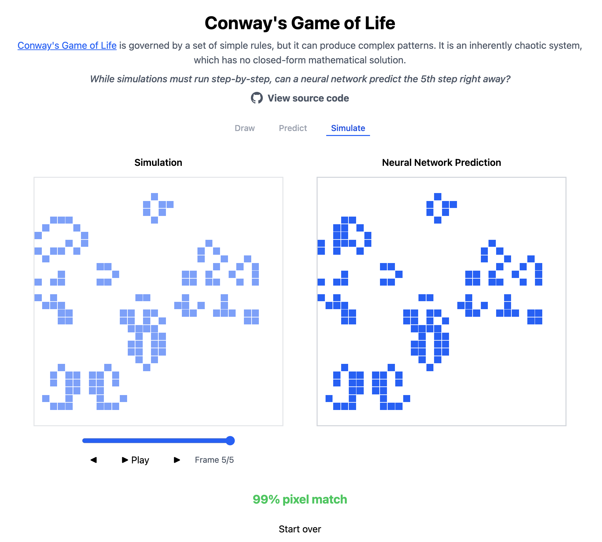
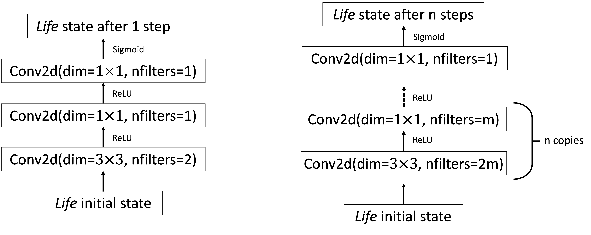
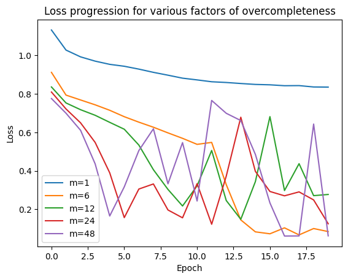

# Solving Conway's Game of Life with a Convolutional Neural Network

> **TL;DR** A small, over-complete CNN can predict the **5-step-ahead** state of Conway's Game of Life on a 32 × 32 grid with **99.998% pixel accuracy** - no iterative simulation required. [Play with the web demo →](https://life.mikavohl.ca)





## Introduction

[Conway's Game of Life](https://en.wikipedia.org/wiki/Conway%27s_Game_of_Life) is a iteration-based game with simple rules which yield suprisingly chaotic behaviour. A consequence of this chaotic behaviour is that there is no closed-form solution for finding the $N$-th next game state based on the current grid.

This restriction motivated me to explore using deep learning methods to attempt to predict the $N$-th next game state with a high level of accuracy. I quickly realized that building a convolutional neural network was the best fit for the task, as Conway's Game of Life's rules are inherently localized to a $3 \times 3$ grid, making convolutional layers with a $3 \times 3$ kernel an obvious choice.

I have deployed my implementation at [life.mikavohl.ca](https://life.mikavohl.ca) in the form of a blank canvas on which the user can input the initial state, then compare the results of direct simulation and the prediction by the CNN.


## 1 · Why treat The Game of Life as a supervised task?

Conway's rules are local (3 × 3 neighbourhood) yet the system can evolve into wildly complex patterns.
That makes the $N$-th state prediction problem an ideal test for studying how far localized deep networks can extrapolate global behaviour.

* **Classical approach**: Step a simulator forward *N* times. Slow.
* **This repo**: Train a CNN to jump straight to the *N*th state in a **single forward pass**.

Why a CNN and not a dense network?


1. **Local Ruleset**:
   Each cell's next state depends *only* on its 3 × 3 neighbourhood. A 3 × 3 convolution does exactly that in one operation. A dense layer, by contrast, connects every cell to every other cell, learning thousands of irrelevant weights that the Game of Life rules never use.

2. **Efficiency**:
   Convolutions slide the *same* 3 × 3 filter across the entire grid. This "reuse" means you learn one rule that applies everywhere. A dense layer would have to relearn that identical rule for every position, exploding the parameter count and slowing training for no benefit.

3. **Translation equivariance**:
   Patterns in Game of Life (gliders, blinkers, etc.) behave the same wherever they appear. Convolutions are inherently translation-equivariant, so a filter that recognises a vertical bar in the top-left also recognises it in the bottom-right.

4. **Alternatives considered**:
   Transformers were considered but ruled out for this prototype, as they are better suited for global dependence problems like language modeling rather than local rulesets. It is to be noted, however, that a well-trained transformer with sufficient compute could in theory learn the ruleset just as well.


---

## 2 · Data Generation

```text
Dataset size   : 50k boards  (previously 5k, then 1M → too slow, settled on 50k for balance)
Board size     : 32 × 32      (initially 64 × 64, less user friendly)
Target step    : N = 5 steps  (N = 10 explored, see #4)
```
Part of the reason I chose to pursue this project is due to the possibility of generating infinite amounts of synthetic data, allowing me to build a machine learning project end-to-end. Since the simulation of the game is trivial, creating data involved the following:
1. Initialize a random board
2. Simulate $N$ steps
3. Store $(X, Y)$ pairs as uint tensors (0 for dead, 1 for alive)
4. Repeat for 50k total pairs
5. Export as a `.h5` file

**Code:** *`src/life_sim/grid.py`*

---

## 3 · Model Architecture

### For $N=5$:
```python
m = 24 # over-completeness factor
self.net = nn.Sequential(
   nn.Conv2d(1, 2*m, kernel_size=3, padding=1), nn.BatchNorm2d(2*m), nn.ReLU(),
   nn.Conv2d(2*m, m, kernel_size=1), nn.BatchNorm2d(m), nn.ReLU(),

   nn.Conv2d(m, 2*m, kernel_size=3, padding=1), nn.BatchNorm2d(2*m), nn.ReLU(),
   nn.Conv2d(2*m, m, kernel_size=1), nn.BatchNorm2d(m), nn.ReLU(),

   nn.Conv2d(m, 2*m, kernel_size=3, padding=1), nn.BatchNorm2d(2*m), nn.ReLU(),
   nn.Conv2d(2*m, m, kernel_size=1), nn.BatchNorm2d(m), nn.ReLU(),

   nn.Conv2d(m, 2*m, kernel_size=3, padding=1), nn.BatchNorm2d(2*m), nn.ReLU(),
   nn.Conv2d(2*m, m, kernel_size=1), nn.BatchNorm2d(m), nn.ReLU(),

   nn.Conv2d(m, 2*m, kernel_size=3, padding=1), nn.BatchNorm2d(2*m), nn.ReLU(),
   nn.Conv2d(2*m, m, kernel_size=1), nn.BatchNorm2d(m), nn.ReLU(),

   nn.Conv2d(m, 1, kernel_size=1)
)
```



**Figure 1.** Life_CNN model architecture. Adapted from Springer & Kenyon, 2020

---

## 4 · Results

| Setting           | Loss   | Pixel Accuracy |
| ----------------- | ------ | -------------- |
| **N = 5** (32×32) | 0.0142 | **99.998 %**   |
| N = 10 (32×32)    | 0.60   | 72 %           |

*Plateauing loss suggests capacity, not data, is the current bottleneck for larger horizons. Switching to residual blocks / skip connections or identifying other methods to improve scaling.*

**Why not iterative CNN prediction?** Predicting each next frame sequentially would merely replicate simulation with extra overhead-defeating the purpose of "deep-learning shortcutting".

### Factor of overcompleteness:



Various factors of overcompleteness were tested across 20 epochs of training. The resulting losses were quite sporadic, but heavily favoured values of $ m \gg 1$. With repeated testing, $m=24$ was a reliably good factor, so it was used for this model.

---

## 5 · Run It Locally

1. **Clone & enter repo**  
   ```bash
   git clone https://github.com/MikaVohl/Game-of-Life-CNN.git
   cd Game-of-Life-CNN
   ```

2. **Install & link the Python package**

   ```bash
   pip install -e .
   ```

   This makes `life_sim` importable in both the Flask API and any notebooks.

3. **Install front-end dependencies**

   ```bash
   cd frontend
   npm install
   ```

4. **Create `frontend/.env`**

   ```bash
   VITE_API_URL=http://localhost:5001
   ```

5. **Run the Flask API**

   ```bash
   cd ../api
   pip install -r requirements.txt  # only once
   python server.py
   ```

6. **Run the front-end**

   ```bash
   cd ../frontend
   npm run dev
   ```

   Visit [http://localhost:5173](http://localhost:5173) to paint cells and compare simulation vs. CNN prediction.

### *Optional: Building & Deploying on AWS Lambda*

1. **Build the Docker image**
   From your project root:

   ```bash
   docker build -t game-of-life:latest -f infra/lambda/Dockerfile .
   ```

2. **Tag & push to ECR**

   ```bash
   # replace placeholders:
   ACCOUNT=123456789012
   REGION=us-east-1
   REPO=game-of-life-lambda

   docker tag game-of-life:latest \
     ${ACCOUNT}.dkr.ecr.${REGION}.amazonaws.com/${REPO}:latest

   aws ecr get-login-password --region ${REGION} | docker login --username AWS --password-stdin ${ACCOUNT}.dkr.ecr.${REGION}.amazonaws.com

   docker push ${ACCOUNT}.dkr.ecr.${REGION}.amazonaws.com/${REPO}:latest
   ```

3. **Create or update your Lambda**

   ```bash
   # create (once):
   aws lambda create-function \
     --function-name life-sim \
     --package-type Image \
     --code ImageUri=${ACCOUNT}.dkr.ecr.${REGION}.amazonaws.com/${REPO}:latest \
     --role arn:aws:iam::${ACCOUNT}:role/YourLambdaExecRole

   # update (after each push):
   aws lambda update-function-code \
     --function-name life-sim \
     --image-uri ${ACCOUNT}.dkr.ecr.${REGION}.amazonaws.com/${REPO}:latest
   ```

4. **Hook up your front-end to Lambda**
   In `frontend/.env`, set:

   ```bash
   VITE_API_URL=https://<your-lambda-url>.lambda-url.${REGION}.on.aws
   ```
   
   Deploy your frontend however you please. I used Vercel's Vite deployment.
---

## 6 · References


```bibtex
@misc{springer2020itshardneuralnetworks,
  title={It's Hard for Neural Networks To Learn the Game of Life},
  author={Jacob M. Springer and Garrett T. Kenyon},
  year={2020},
  eprint={2009.01398},
  archivePrefix={arXiv},
  primaryClass={cs.LG}
}
```