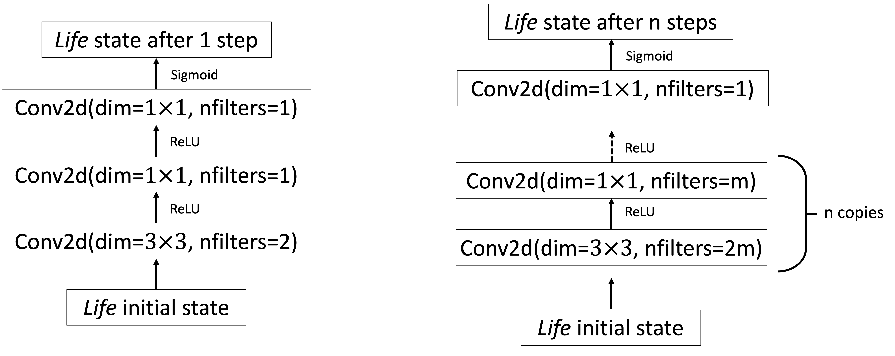
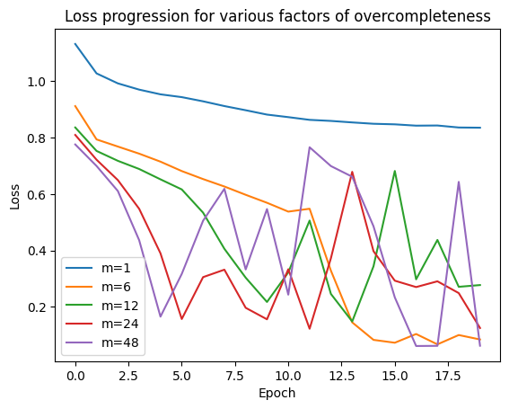

# Solving Conway's Game of Life using a Convolutional Neural Network

[Conway's Game of Life](https://en.wikipedia.org/wiki/Conway%27s_Game_of_Life) is a iteration-based game with simple rules which yield suprisingly chaotic behaviour. A consequence of this chaotic behaviour is that there is no closed-form solution for finding the Nth next game state based on the current grid.

This restriction motivated me to explore using deep learning methods to attempt to predict the Nth next game state with a high level of accuracy. I quickly realized that building a convolutional neural network was the best fit for the task, as Conway's Game of Life's rules are inherently localized to a 3x3 grid, making convolutional layers with a 3x3 kernel an obvious choice.

I have deployed my implementation at [life.mikavohl.ca](life.mikavohl.ca) in the form of a blank canvas on which the user can input the initial state, then compare the results of direct simulation and the prediction by the CNN.

## Model Architecture
```
m = 24
self.net = nn.Sequential(
   nn.Conv2d(1, 2*m, kernel_size=3, padding=1), nn.BatchNorm2d(2*m), nn.ReLU(),
   nn.Conv2d(2*m, m, kernel_size=1), nn.BatchNorm2d(m), nn.ReLU(),

   nn.Conv2d(m, 2*m, kernel_size=3, padding=1), nn.BatchNorm2d(2*m), nn.ReLU(),
   nn.Conv2d(2*m, m, kernel_size=1), nn.BatchNorm2d(m), nn.ReLU(),

   nn.Conv2d(m, 2*m, kernel_size=3, padding=1), nn.BatchNorm2d(2*m), nn.ReLU(),
   nn.Conv2d(2*m, m, kernel_size=1), nn.BatchNorm2d(m), nn.ReLU(),

   nn.Conv2d(m, 2*m, kernel_size=3, padding=1), nn.BatchNorm2d(2*m), nn.ReLU(),
   nn.Conv2d(2*m, m, kernel_size=1), nn.BatchNorm2d(m), nn.ReLU(),

   nn.Conv2d(m, 2*m, kernel_size=3, padding=1), nn.BatchNorm2d(2*m), nn.ReLU(),
   nn.Conv2d(2*m, m, kernel_size=1), nn.BatchNorm2d(m), nn.ReLU(),

   nn.Conv2d(m, 1, kernel_size=1)
)
```

**Figure 1.** Life_CNN model architecture. Adapted from Springer & Kenyon, 2020

After experimenting with different architectures and obtaining sub-par results, I eventually adapted much of the model from a proposed framework in *"It's Hard for Neural Networks To Learn the Game of Life"* by Springer and Kenyon.

The intuition behind this architecture stems from the localization of the game of life. In the game of life, predicting point $P$'s state $N$ steps in the future is dependent on the initial states of all the cells within a distance of $N$ from $P$. This is geometrically intuitive as at every step a cell can only be influenced by those at a distance of $1$.

Given this information, I initally considered using a convolutional kernel of dimension $(2N+1) \times (2N+1)$. This made sense intuitively, as this allows the output of a cell to depend on all states within a distance of $N$ of it. By experimentation, however, it turns out that this was not optimal due to the quadratically increasing number of parameters. Instead, as the paper suggested, a single $(2N+1) \times (2N+1)$ kernel could be substituted by stacking $N$ copies of two convolutional layers with kernels of dimension $3 \times 3$ and $1 \times 1$ respectively.

Combining the stacked kernels with the notion of a "factor of overcompleteness" introduced in Springer & Kenyon, the model yielded excellent results.

Attempting to apply this approach to larger values of $N$ proved challenging. Setting $N=10$, the same approach to training was only able to yield a loss on the order of $0.6$, with a pixel accuracy of $\sim72\%$, compared to the $N=5$ case which achieved loss of $0.0142$ and $99.998\%$ pixel accuracy.


<br>**Figure 2.** Loss progression for various factors of overcompleteness. Loss taken up to 20 epochs on 50k training examples, 32x32 grid, 5 steps into the future.

## Setup

### Prerequisites

- **Node.js & npm** (v18+ recommended)  
- **Python** (3.11+)  
- **Docker** (for building/running the Lambda image)  
- **AWS CLI v2** configured with an IAM user that can push to ECR & update Lambda

---

### Running Locally

1. **Clone & enter repo**  
   ```bash
   git clone https://github.com/MikaVohl/Game-of-Life-CNN.git
   cd Game-of-Life-CNN
   ```

2. **Install & link the Python package**

   ```bash
   pip install -e .
   ```

   This makes `life_sim` importable in both the Flask API and any notebooks.

3. **Install front-end dependencies**

   ```bash
   cd frontend
   npm install
   ```

4. **Create `frontend/.env`**

   ```bash
   VITE_API_URL=http://localhost:5001
   ```

5. **Run the Flask API**

   ```bash
   cd ../api
   pip install -r requirements.txt  # only once
   python server.py
   ```

6. **Run the front-end**

   ```bash
   cd ../frontend
   npm run dev
   ```

   Visit [http://localhost:5173](http://localhost:5173) to paint cells and compare simulation vs. CNN prediction.

---

### Building & Deploying on AWS Lambda

1. **Build the Docker image**
   From your project root:

   ```bash
   docker build -t game-of-life:latest -f infra/lambda/Dockerfile .
   ```

2. **Tag & push to ECR**

   ```bash
   # replace placeholders:
   ACCOUNT=123456789012
   REGION=us-east-1
   REPO=game-of-life-lambda

   docker tag game-of-life:latest \
     ${ACCOUNT}.dkr.ecr.${REGION}.amazonaws.com/${REPO}:latest

   aws ecr get-login-password --region ${REGION} | docker login --username AWS --password-stdin ${ACCOUNT}.dkr.ecr.${REGION}.amazonaws.com

   docker push ${ACCOUNT}.dkr.ecr.${REGION}.amazonaws.com/${REPO}:latest
   ```

3. **Create or update your Lambda**

   ```bash
   # create (once):
   aws lambda create-function \
     --function-name life-sim \
     --package-type Image \
     --code ImageUri=${ACCOUNT}.dkr.ecr.${REGION}.amazonaws.com/${REPO}:latest \
     --role arn:aws:iam::${ACCOUNT}:role/YourLambdaExecRole

   # update (after each push):
   aws lambda update-function-code \
     --function-name life-sim \
     --image-uri ${ACCOUNT}.dkr.ecr.${REGION}.amazonaws.com/${REPO}:latest
   ```

4. **Hook up your front-end to Lambda**
   In `frontend/.env`, set:

   ```bash
   VITE_API_URL=https://<your-lambda-url>.lambda-url.${REGION}.on.aws
   ```
   
   Deploy your frontend however you please. I used Vercel's Vite deployment.